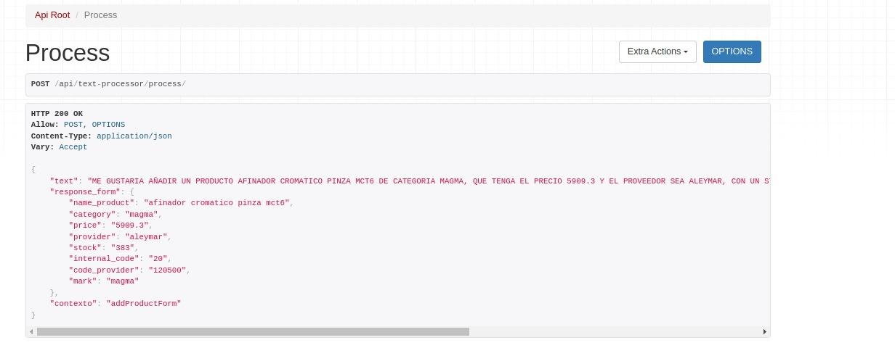

# botand-form: Procesador de Texto a JSON para Formularios

**botand-form** es un procesador de texto diseñado para simplificar la creación y carga de formularios a partir de descripciones de texto. Este proyecto toma un texto de entrada y lo desfragmenta en un formato JSON estructurado, lo que facilita su uso en aplicaciones que requieren la captura y procesamiento de datos mediante formularios.


## Características

- **Desfragmentación de Texto**: Convierte descripciones textuales en objetos JSON claros y organizados.
- **Adaptación a Formularios**: El JSON generado es fácilmente integrable en sistemas de formularios, optimizando la carga de datos.
- **Configuración Flexible**: Permite ajustar los parámetros de desfragmentación según las necesidades del proyecto.

## Ejemplo de Uso

Dado un texto como: Me gustaria añadir un producto AFINADOR CROMATICO PINZA MCT6 de categoria MAGMA, que tenga el precio 5909.3 y el proveedor sea ALEYMAR, con un stock 383, con un codigo de proveedor 20 y el codigo interno para el producto 120500 para la marca MAGMA


## Funcionalidad

El modelo general de la base de datos es asi:

- **Context**: La tabla context va a albergar los diferentes tipos de formulario que se van a procesar, ya sea para añadir productos, pacientes, añadir evoluciones, etc...

- **LabelByContext**: la tabla va a albergar todas las etiquetas o dicho de otra forma todos los campos que van a corresponder a la tabla, la misma esta relacionada al contexto...

*Relacion Context y LabelByContext 1-M*

-**SchemeByContext**: La tabla va a guardar todos los esquemas y formas en la que el usuario va a poder encarar la carga desde el front-end con microfono...
```json
{
    "descripcion": "Me gustaria añadir un producto {0} de categoria {1}, que tenga el precio {2} y el proveedor sea {3}, con un stock {4}, con un codigo de proveedor {5} y el codigo interno para el producto {6} para la marca {7}",
    "contexto": "66bfff2f8fdcc6e0fa23713b",
    "labels": [
        {
            "refString": "{0}",
            "labelByContext_id": "66c48e0b5b0bf637f28a5f6a"
        },
        {
            "refString": "{1}",
            "labelByContext_id": "66c48e1d5b0bf637f28a5f6b"
        },
        {
            "refString": "{2}",
            "labelByContext_id": "66c48e3c5b0bf637f28a5f6c"
        },
        {
            "refString": "{3}",
            "labelByContext_id": "66c4c760391ddd257becb343"
        },
        {
            "refString": "{4}",
            "labelByContext_id": "66c48e5d5b0bf637f28a5f6d"
        },
        {
            "refString": "{5}",
            "labelByContext_id": "66c48e705b0bf637f28a5f6e"
        },
        {
            "refString": "{6}",
            "labelByContext_id": "66c48eef5b0bf637f28a5f6f"
        },
        {
            "refString": "{7}",
            "labelByContext_id": "66c48f015b0bf637f28a5f70"
        }
    ]
}
```

**botand-form** generará un JSON como:

```json
{
  "producto": "AFINADOR CROMATICO PINZA MCT6",
  "categoria": "MAGMA",
  "precio": 5909.3,
  "proveedor":"ALEYMAR",
  "stock":383,
  "codigo_proveedor":"20",
  "codigo_interno":"120500",
  "marca":"MAGMA"
}


